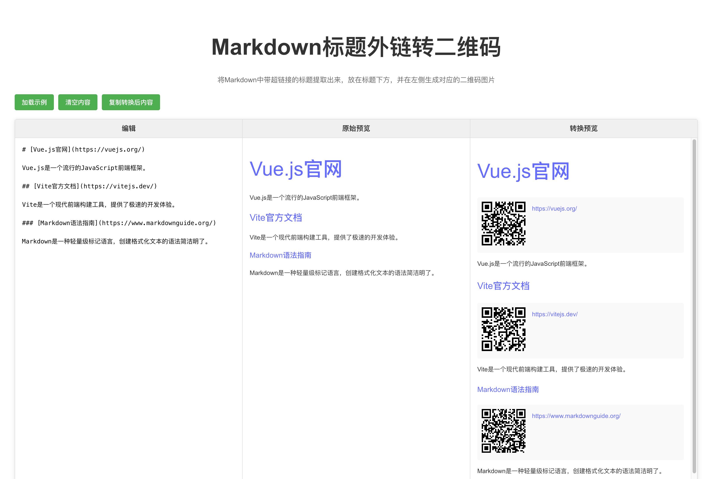

# Markdown标题外链转二维码工具 (md-qrlink)

**使用 Trae（Claude-3,7-sonnet）生成，人工微调**

适用于微信公众号等不支持直接跳转外部链接的平台使用，搭配 https://github.com/doocs/md 使用更加



## 项目简介

这是一个基于Vue 3和Vite开发的Web应用，用于将Markdown文档中带超链接的标题提取出来，在标题下方显示对应的链接和二维码图片。这对于需要在微信公众号等不支持外部链接的平台发布文章时特别有用，读者可以通过扫描二维码访问链接。

## 功能特点

- 解析Markdown文档，识别带超链接的标题
- 自动在标题下方生成对应的二维码和链接文本
- 提供原始预览和转换后预览的对比视图
- 支持一键复制转换后的内容（包含二维码图片）
- 自动保存编辑内容到本地缓存
- 响应式设计，同时支持桌面端和移动端
- 移动端提供便捷的预览切换功能

## 使用方法

### 在线使用

1. 访问应用网址（https://atqq.github.io/md-qrlink/）
2. 在编辑区输入或粘贴Markdown内容
3. 实时查看原始预览和转换后的效果
4. 点击「复制转换后内容」按钮，将内容复制到剪贴板
5. 粘贴到微信公众号等平台

### 本地开发

```bash
# 克隆项目
git clone https://github.com/ATQQ/md-qrlink.git

# 进入项目目录
cd md-qrlink

# 安装依赖
npm install

# 启动开发服务器
npm run dev

# 构建生产版本
npm run build
```

### GitHub Pages 部署

本项目已配置 GitHub Actions 自动部署到 GitHub Pages：

1. Fork 或克隆本仓库
2. 启用仓库的 GitHub Pages 功能，选择 GitHub Actions 作为构建和部署源
3. 推送代码到 main 分支，GitHub Actions 将自动构建并部署

也可以手动触发部署：

1. 在仓库页面，点击 Actions 标签
2. 选择 "Deploy to GitHub Pages" 工作流
3. 点击 "Run workflow" 按钮

## 技术栈

- **前端框架**: Vue 3 (使用Composition API和`<script setup>`语法)
- **构建工具**: Vite
- **路由管理**: Vue Router
- **Markdown解析**: markdown-it
- **二维码生成**: qrcode 和qrcode.vue
- **本地存储**: localStorage API
- **CI/CD**: GitHub Actions (自动部署到 GitHub Pages)

## 核心实现原理

### Markdown解析与转换

1. **原始解析**：使用markdown-it库将Markdown文本解析为HTML
2. **标题链接识别**：使用正则表达式`/^(#{1,6})\s*\[(.+?)\]\((.+?)\)(.*)$/`识别带超链接的标题
3. **内容转换**：
   - 保留原始标题
   - 在标题下方添加包含二维码和链接的HTML结构

### 二维码生成

- 使用qrcode.js库生成二维码
- 在预览模式下，使用Vue组件动态渲染二维码
- 在复制模式下，将二维码转换为base64图片嵌入HTML

### 响应式设计

- 桌面端：三列并排显示（编辑、原始预览、转换预览）
- 移动端：单列显示，通过顶部标签页切换不同视图
- 使用媒体查询和动态检测屏幕宽度实现自适应布局

### 数据持久化

- 使用localStorage自动保存用户编辑的内容
- 应用启动时自动加载上次编辑的内容或示例内容

### 自动部署

- 使用GitHub Actions自动构建和部署应用到GitHub Pages
- 配置SPA路由处理，确保刷新页面和直接访问子路由时不会出现404错误
- 自动适配GitHub Pages的基本路径，确保资源正确加载

## 项目结构

```
.github/                # GitHub配置
├── workflows/          # GitHub Actions工作流
│   └── deploy.yml      # 自动部署到GitHub Pages的工作流配置
public/                 # 静态资源
├── 404.html            # SPA路由处理页面
├── .nojekyll           # 禁用GitHub Pages的Jekyll处理
src/
├── components/         # 组件
│   ├── MarkdownEditor.vue  # 编辑器组件
│   └── QRCodeGenerator.vue # 二维码生成组件
├── utils/              # 工具函数
│   └── markdownParser.js   # Markdown解析和转换逻辑
├── views/              # 页面视图
│   └── Home.vue           # 主页面
└── App.vue             # 应用入口组件
```

## 贡献指南

欢迎提交问题和功能请求！如果您想贡献代码，请遵循以下步骤：

1. Fork项目
2. 创建您的特性分支 (`git checkout -b feature/amazing-feature`)
3. 提交您的更改 (`git commit -m 'Add some amazing feature'`)
4. 推送到分支 (`git push origin feature/amazing-feature`)
5. 打开一个Pull Request

## 许可证

[MIT License](LICENSE)
